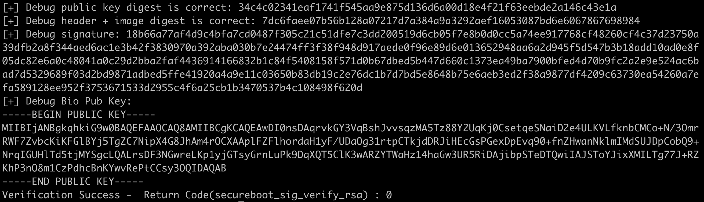

# Introduction
This is a secure boot proof of concept which is going to be used as a challenge for new candidates.

The challenge is described **[link](https://docs.google.com/document/d/1eLC2lU1nXPM4MPzaPCbX5O9jPEZ7BgO4auIGpP58d78/edit#)**.

This git repository is structured in:
* **samples** folder  that contains the source code of the sample application, called test1.c, that will be signed by the Certificate Authority. Note the makefile compiles the sample images. At the time being, the sample app is a classical hello world.
* **scripts** folder that contains a python script that instruments the signature process and generation of key pairs. Make sure to install the requirements for using the script. More details in the [INSTALL.md](INSTALL.md).
* **src** folder that contains a runnable implementation of a secure boot in C based on openssl-devel. Make sure to have the openssl development library installed on your workstation. More details in the [INSTALL.md](INSTALL.md).
* There are two extra temporary folders (**build** and **unit_test**) that are created as a consequence of the building and running process.

## Build
The makefile is self-explanatory but following the main targets:
* *install*, it creates the necessary folders used by the source code.
* *gen_sample_bin*, it goes to the **samples** folder and compile the sample.
* *build_sign_sample_image*, it signs the sample using a new generated RSA keypair. If you would like to keep the same RSA keypair, do not use the *clean* target.
* *test_sign_keypair*, it tests the RSA keypair
* *build_secureboot_app*, it compiles and links the secure boot's source code and generates a test executable in the root repository folder.
* *clean*, it cleans the temporary folders and files
* *all*, instruments all in one.

The openssl library is used by the secure boot code. Thus, in order to build the source code, it is convenient to define the following global variables:
LDFLAGS=-L\<path to openssl lib folder\>
CPPFLAGS=-I\<path to openssl include folder\>
PKG_CONFIG_PATH=\<path to openssl lib pkgconfig\> (relevant for OSX)

## Usage
An executable called *test* is created in the root repository folder used to verify the signed images.

Execute it using `./test` and the outcome of the execution will be



### Docker image
A docker container is also created to facilite the portability. Use the following sequence to execute the app:
1. `docker build -t="ikanekb/openssl" .`
2. `docker run --rm -it  --name openssl ikanekb/openssl`

# Challenges

## Environments

I have built and tested the code in M1 Mac book and used following version of gcc and Python.

```bash
$ gcc -v
Apple clang version 14.0.0 (clang-1400.0.29.102)
Target: arm64-apple-darwin21.6.0
```
```bash
$ python3 --version
Python 3.10.3
```

I installed OpenSSL and prerequisite python packages like below.

```bash
brew install openssl
export LDFLAGS=-L/opt/homebrew/opt/openssl@3/lib
export CPPFLAGS=-I/opt/homebrew/opt/openssl@3/include
```

```bash
pip install -r scripts/requirement.txt
```

## Protections against rollback

### Problem

Downgrading to older images can raise security concerns as it would revert back security fixes introduced in newer images. If it's required to allow downgrading for some reasons, it should have additional indicator independent from image version such as security counter to indicate whether the image has the latest security fixes or not.

### How to solve

For simplicity I have set a policy that does not allow rollback to the previous version in any cases for this challenge. So that the installed image version in a device can increase only.

#### Updating format of the image header

|Offset|Fields|
|---|---|
|0|Magic|
|4|**Version** (added)|
|8|Image offset|
|16|Image len|
| |...|

**Version** field have been added right after **Magic** field in the image header as above table.

#### Writing version to the image header

[*image.py*](scripts/image.py) already has **version** as its parameter but it was not used inside.
To utilize it, I have modified *image.py* to write the version onto the header while building signed image.

```Python
def buildSignedImg(self, rsa_kp_path, ecdsa_kp_path, out_path):

#...

self.img_payload = bytes.fromhex(IMAGE_MAGIC) + \
          int(self.version).to_bytes(4, byteorder = self.endian) + \
          #...
```

And [*makefile*](makefile) have been updated to set the image version via an environmental variable.

```
# set image version to 6 as default
IMAGE_VERSION=6

...

# sign the sample image
build_sign_sample_image:
	python3 $(SCRIPT_FOLDER)/image.py $(RUN_FOLDER) $(SAMPLE_TEST) $(IMAGE_VERSION)
```

For example, the below command will generate the signed image with version 7.
```bash
$ make all IMAGE_VERSION=7
```

#### Protecting rollback on verification

First, I have added a definition in [secureboot.h](src/include/secureboot.h) to get the current image version of the device. In real application, it may be located in well protected NVM memory such as OTP, flash etc. Also it can utilize some HW counters to give more security on this. But right now it's just a macro.

```C
// Version supposed to be embedded in NVM memory such as OTP, flash etc
// Assumes the version of current installed image is 5 for test purpose
#define EMBEDDED_VERSION    5
```

In [src/secureboot.c](src/secureboot.c), *secureboot_rollback()* is implemented like below.
It compares the current image version of the device and the image version of the target image and pass only if the image version of the target image is newer one.

```C
static int secureboot_rollback(const uint8_t *payload, uint8_t cur_version)
{
    // Extract version from the header
    volatile int version = getFieldFromHeader(payload, OFF_VERSION);

    // Assumes always use the latest version and rollback is never allowed.
    IF_AND( cur_version < version ) {
        return VERIFY_SUCCESS;
    }
    else {
        return VERIFY_VERSION_ERROR;
    }
}
```

And this function is now part of the image verification process in *secureboot_validate_image()*.

```C
int
secureboot_validate_image(uint8_t *payload, uint8_t *tmp_buf,
                      uint32_t tmp_buf_sz)
{

    ...

    // verify the image version is not an old one
    IF_OR( ( rc = secureboot_rollback(payload, EMBEDDED_VERSION) ) != VERIFY_SUCCESS ) {
        // error means that the version of payload is deprecated
        printf("Image rollback is detected\n" );
        goto out;
    }

    ...
}
```

### Testing

I could test rollback protection like below.

```bash
$ make all IMAGE_VERSION=4
...
Image rollback is detected
Assertion failed: (rc == VERIFY_SUCCESS), function main, file test.c, line 81.
Error validate the signature 7ffffff3 make: *** [all] Abort trap: 6
```

## Secure implementation of memcmp()

### Problem
The basic idea is preventing timing attacks which could infer the occurrence of the first mismatched byte from measured time duration of *memcmp()*.
Here's a related quote from [man page](https://man7.org/linux/man-pages/man3/memcmp.3.html).

>        Do not use memcmp() to compare security critical data, such as
>        cryptographic secrets, because the required CPU time depends on
>        the number of equal bytes.  Instead, a function that performs
>        comparisons in constant time is required.  Some operating systems
>        provide such a function (e.g., NetBSD's consttime_memequal()),
>        but no such function is specified in POSIX.  On Linux, it may be
>        necessary to implement such a function oneself.

### How to solve

I have taken care of two things during implementation- the code consumes the same or very similar CPU cycles for each iteration and it doesn't break out during the comparison. By doing that secured version *memcmp()* can achieve a constant execution time for the same comparison size.
And I decided to drop one feature of original *memcmp()* that provides information about which one is greater or less between first mismatched characters of two inputs as it is not needed for our application and also makes things difficult to implement as I designed.

Here's my implementation for secured *memcmp()*.

```C
static int secureboot_memcmp(const void *s1, const void *s2, size_t n)
{
    int rc = 0;
    for( size_t i = 0; i < n; ++i ) {
        // Make it runs at the same number of cycles whether they match or not.
        rc |= (int) ( *( (const char*)s1 + i ) - *( (const char*)s2 + i ) );

        // Go till the end of buffers
    }
    return rc;
}
```

### Testing

I have added an unit test for the secured version of *memcmp()* and it shows good result.
The unit test has fixed set of various input data which have different location of mismatched bytes. While *memcmp()* shows inconsistent excution times which are relavant to occurrences of the first mismatched byte, *secureboot_memcmp()* shows flat and constance excution times.

```bash
- original memcmp() test
1-th test: 0.000024 sec
2-th test: 0.000011 sec
3-th test: 0.000013 sec
4-th test: 0.000029 sec
- secureboot_memcmp() test
1-th test: 0.000021 sec
2-th test: 0.000021 sec
3-th test: 0.000021 sec
4-th test: 0.000022 sec
```

## Supporting Eliptic Curve verification

### Problem

It is relatively a straight-forward task for me as it was mostly finding the right API for Eliptic Curve in crypto libraries such as hazmat, pycryptodome and OpenSSL. But still there were a few thinking points to me like below.

- Will we add both RSA and ECDSA in the same image or using only one verification method at one time?
- How to add the key and signature of ECDSA to the image?
- How to handle variable length of ECDSA signature?

### How to solve

- Will we add both RSA and ECDSA in the same image or using only one verification method at one time?
- How to add the key and signature of ECDSA to the image?
I have decided to include both RSA and ECDSA signatures in the same image for simplicity. It may or may not be practical to use both verifications at the same time but it makes a lot of things simple and I have felt it's suitable for this challenge.
- How to handle variable length of ECDSA signature?
I have been thinking of adding some padding at the end of signature to make it fixed length but couldn't find a safe way to recover back the original length of signature at the device side. So I ended up adding the length of ECDSA signature in trailer part of the image. As this area is not covered by hash, I feel it's a vulnerability and I believe it needs to be covered by another verification method (maybe with proper implementation of TLV section).

### Updating format of the image header

|Offset|Fields|
|---|---|
|0|Magic|
|4|Version|
|8|Image offset|
|12|Image len|
|16|RSA public key offset|
|20|RSA public key length|
|24|**ECDSA public key offset** (added)|
|28|**ECDSA public key length** (added)|
|32|Hash offset|
|36|Hash length|
|40|RSA signature offset|
|44|RSA signature length|
|48|**ECDSA signature length offset** (added)|
|52|**ECDSA signature offset** (added)|
|56|Total|

The public key and the signature for ECDSA have been added to the image header as above table.
One thing to note is that **ECDSA signature length offset** is contained in the image header instead of signature length itself and the length is located in the trailer part which is pointed by **ECDSA signature length offset**. Both RSA and ECDSA signatures sign the same Hash digest contains in **Hash Offset**.

### Writing key and signature to the image

I have added the following codes to [*image.py*](scripts/image.py) for supporting ECSDA verification.

- Generating ECDSA keypair.
```Python
    def _createECDSAKeypair(self, path, passwd=None):
        """Create private method for ECDSA Key using two external libraries
            pycryptodome or hazmat."""
        ...
```

```Python
    def getECDSAPublicKey(self, path, password=None):
        """ Generate the ECDSA public key and keypair if it does not exists using two external libraries
            pycryptodome or hazmat."""
        ...
```

- Signing the image with ECDSA is added in this function.
```Python
    def buildSignedImg(self, rsa_kp_path, ecdsa_kp_path, out_path):
        """ Compute the signature RSA based on PSS or PKCS1v15 and ECDSA """
        ...
                # Sign ECDSA signature
                self.ecdsa_signature = self.ecdsa_private_key.sign(
                    digest.digest(),
                    ec.ECDSA(hashes.SHA256()))
                print(len(self.ecdsa_signature))
```

```Python
    def verifySignature(self):
        """ Verify the signature RSA based on PSS or PKCS1v15 and ECDSA"""
        ...
                # Verify ECDSA signature
                self.ecdsa_public_key.verify(
                    self.ecdsa_signature,
                    digest.digest(),
                    ec.ECDSA(hashes.SHA256())),
```

- Exporting the ECDSA public key to keys.h.
```Python
    def exportPublicKeys_in_C(self, path, indent="    "):
        """ Generate the C-header with the public key, length and hash used by
            C-code to verify the public key. """
        ...
            # Export ECDSA Keys
            f.write("const unsigned char ecdsa256_pub_key[] = {")
            if self.hazmat:
                key = self.ecdsa_public_key.public_bytes(
                    encoding=serialization.Encoding.DER,
                    format=serialization.PublicFormat.SubjectPublicKeyInfo)
            else:
                key = self.ecdsa_public_key
            for count, b in enumerate(key):
                if count % 8 == 0:
                    f.write("\n" + indent)
                else:
                    f.write(" ")
                coma = "," if count != (len(key) - 1) else "\n"
                f.write("0x{:02x}{}".format(b,coma))
            f.write("}; \n\n")
            f.write("const unsigned int ecdsa256_pub_key_len = {};\n\n".format(len(key)))
            f.write("/**\n* @Note: this value needs to be stored in OTP\n**/\n")
            f.write("const unsigned char ecdsa256_pub_key_hash[] = {")
            for count, b in enumerate(bytes.fromhex(SHA256.new(key).hexdigest())):
                if count % 8 == 0:
                    f.write("\n" + indent)
                else:
                    f.write(" ")
                coma = "," if count != (HASH_SIZE - 1) else "\n"
                f.write("0x{:02x}{}".format(b, coma))
            f.write("}; \n")
```

### Verification on the device

*secureboot_sig_verify_ec()* is very similar to *secureboot_sig_verify_rsa()* due to the high-level OpenSSL APIs in [*secureboot.c*](src/secureboot.c).

Some different parts from *secureboot_sig_verify_rsa()* are shown as below.

```C
/**
 * @brief Challenge: Implement a signature verification supporting Eliptic Curve
 * using openssl primitives and provide a keys.h with example of keys
 */
static int secureboot_sig_verify_ec(const uint8_t *hash, uint32_t hlen, const uint8_t *payload,
        uint8_t *tmp_buf, uint32_t tmp_buf_sz, const struct opt_key *opt_key)
{
    ...

    // Get the size of ECDSA signature in the trailer part (ECDSA signature has a variable size)
    // TODO: add sanity check to prevent overrun if value in OFF_ECDSA_SIGN_LEN is bigger than the payload size
    siglen = getFieldFromHeader(payload, getFieldFromHeader(payload, OFF_ECDSA_SIGN_LEN) +
            OFF_OFF_HDR);

    ...

    // Get EC_KEY first
    eckey = PEM_read_bio_EC_PUBKEY(bufio, NULL, NULL, NULL);
    IF_OR( eckey == NULL || len <= 0 ) {
        rc = EVP_PKEY_INIT_ERROR;
        goto out_buf;
    }
    // Convert EC_KEY to EVP_PKEY
    pkey = EVP_PKEY_new();
    rc = EVP_PKEY_set1_EC_KEY(pkey, eckey);
    IF_OR( !rc ) {
        rc = EVP_PKEY_INIT_ERROR;
        goto out_buf;
    }

    ...
}
```

And this function is now part of the image verification process in *secureboot_validate_image()*.

```C
int
secureboot_validate_image(uint8_t *payload, uint8_t *tmp_buf,
                      uint32_t tmp_buf_sz)
{

    ...

    // verify the signature of the image with ECDSA public key
    IF_OR( ( rc = secureboot_sig_verify_ec(hash, HASH_SZ, payload, tmp_buf,
            tmp_buf_sz, &opt_keys[1]) ) != VERIFY_SUCCESS ) {
        // error means that verification is incorrect
        printf("ECDSA Signature verification is failed\n" );
        goto out;
    }

    ...
}
```

### Testing

ECSDA signing of the image is part of the default procedure now.
And I have added an unit test to validate the function with a fixed test vector.

Output from a successful run will be like below.

```bash
$ make all
...
Verification Success - 	Return Code(secureboot_sig_verify_rsa) : 80000000
[+] Debug ECDSA signature: 3044022008e107a3a2b031c6b1ce45404ebdc8a13f090841c542797b1e852bd5a7de852702202220ae1adc22c27844ed33186439fe9e1ef3a89f5f1d6805593f98f819ff015d
[+] Debug Debug Bio ECDSA Pub Key: -----BEGIN PUBLIC KEY-----
MFkwEwYHKoZIzj0CAQYIKoZIzj0DAQcDQgAE/8TGSKV0ASqTAMEYI/NqhUnDDLrz3HA1wttQb+4cBgjZ4skGGwTc+OCTD9DGs4/rY0TYJg76x9nSsXENLwCQwQ==
-----END PUBLIC KEY-----
Verification Success - 	Return Code(secureboot_sig_verify_ec) : 80000000
```


## Extra: Protection against perturbation attacks

### Problem

There can be a perturbatioa attacks by injecting a fault. There's a possibility that an attack can inject external glitches to make a loop break out, skipping branch out etc. It's not easy to detect or recover at SW side once the damage or exploit is done successfully.

### How to solve

I have found a well-written article about [SW based fault injection counter measures](https://research.nccgroup.com/2021/07/08/software-based-fault-injection-countermeasures-part-2-3/).
This article introduces several SW methods to provide resiliency and I selectively applied them to the code.

#### Failure handling

I have added a following inline function to provide un-recoverable failure state. It is considered to be safer than just doing an infinite loop. I haven't applied this function much in the current scenario but it would be useful to handle the fatal cases.

```C
/**
 * @brief It handles the fatal error.
 *        It will trigger a NULL dereference immediately to prevent fault injection.
 */
static inline void fatal(void)
{
    *(volatile uint32_t*) 0;
}
```

Here's an example code.
```C
static inline int check_endian(void){
    uint32_t x = 1;
    uint8_t *test = (uint8_t*)&x;
    volatile int rc = (int)*test;
    IF_AND(rc == (int)(*(uint8_t*)&x)) {
        return rc;
    }
    else {
        fatal();
        return rc;
    }
}
```

#### Redundant conditionals

I have added following macros to provide redundant conditionals which could prevent a single glitch bypassing verification steps. There are two macros and you may choose one case by case to preventa single glitch from jumping into an insecure state.

```C
/* Macros for redundant conditionals */
/* Inspired by https://research.nccgroup.com/2021/07/08/software-based-fault-injection-countermeasures-part-2-3/ */
#define IF_AND(cond)  if((cond) && (cond) && (cond))
#define IF_OR(cond)   if((cond) || (cond) || (cond))
```

Here's an example code.
```C
    // Get signature length from header
    siglen = getFieldFromHeader(payload, OFF_RSA_SIGN_LEN);
    IF_OR( siglen != RSA_SIG_BUF_SZ ) {
        rc = IMAGE_FORMAT_ERROR;
        goto out;
    }
```

#### Redundant memory reading

Redundant memory reading can also make attackers hard to bypass the verification by a single glitch.
I have applied this method to several places.

Here's an example code.

```C
/**
 * @brief Helper function to extract the field from the header.
 */
static inline int getFieldFromHeader(const uint8_t *payload, int off)
{
    volatile int data = _getFieldFromHeader(payload, off);

    // Read memory redundantly to make it difficult to inject a faulty
    IF_OR( data != _getFieldFromHeader(payload,off ) ) {
        fatal();
    }

    return data;
}
```

#### And many more redundancies..

I added every verification step runs three times to prevent perturbation attacks.

```C
    // verify the image version is not an old one
    IF_OR( ( rc = secureboot_rollback(payload, EMBEDDED_VERSION) ) != VERIFY_SUCCESS ) {
        // error means that the version of payload is deprecated
        printf("Image rollback is detected\n" );
        goto out;
    }
```

### Testing

Most applied methods are not very visible but you may find the verification steps run multiple times like below.

```bash
----END PUBLIC KEY-----
Verification Success - 	Return Code(secureboot_sig_verify_rsa) : 80000000
[+] Debug ECDSA signature: 3044022008e107a3a2b031c6b1ce45404ebdc8a13f090841c542797b1e852bd5a7de852702202220ae1adc22c27844ed33186439fe9e1ef3a89f5f1d6805593f98f819ff015d
[+] Debug Debug Bio ECDSA Pub Key: -----BEGIN PUBLIC KEY-----
MFkwEwYHKoZIzj0CAQYIKoZIzj0DAQcDQgAE/8TGSKV0ASqTAMEYI/NqhUnDDLrz3HA1wttQb+4cBgjZ4skGGwTc+OCTD9DGs4/rY0TYJg76x9nSsXENLwCQwQ==
-----END PUBLIC KEY-----
Verification Success - 	Return Code(secureboot_sig_verify_ec) : 80000000
[+] Debug ECDSA signature: 3044022008e107a3a2b031c6b1ce45404ebdc8a13f090841c542797b1e852bd5a7de852702202220ae1adc22c27844ed33186439fe9e1ef3a89f5f1d6805593f98f819ff015d
[+] Debug Debug Bio ECDSA Pub Key: -----BEGIN PUBLIC KEY-----
MFkwEwYHKoZIzj0CAQYIKoZIzj0DAQcDQgAE/8TGSKV0ASqTAMEYI/NqhUnDDLrz3HA1wttQb+4cBgjZ4skGGwTc+OCTD9DGs4/rY0TYJg76x9nSsXENLwCQwQ==
-----END PUBLIC KEY-----
Verification Success - 	Return Code(secureboot_sig_verify_ec) : 80000000
[+] Debug ECDSA signature: 3044022008e107a3a2b031c6b1ce45404ebdc8a13f090841c542797b1e852bd5a7de852702202220ae1adc22c27844ed33186439fe9e1ef3a89f5f1d6805593f98f819ff015d
[+] Debug Debug Bio ECDSA Pub Key: -----BEGIN PUBLIC KEY-----
MFkwEwYHKoZIzj0CAQYIKoZIzj0DAQcDQgAE/8TGSKV0ASqTAMEYI/NqhUnDDLrz3HA1wttQb+4cBgjZ4skGGwTc+OCTD9DGs4/rY0TYJg76x9nSsXENLwCQwQ==
-----END PUBLIC KEY-----
Verification Success - 	Return Code(secureboot_sig_verify_ec) : 80000000
```
